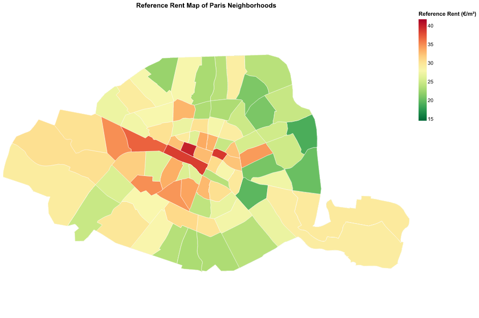
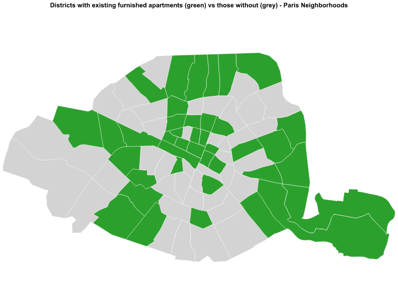
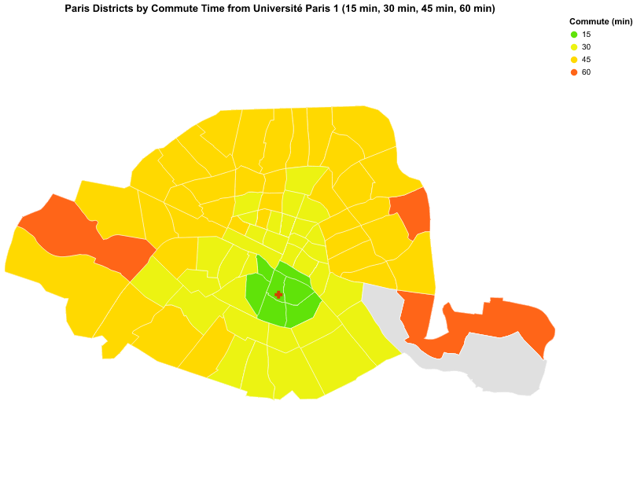

# DSBA-FavorableHousingParis

## About this project

Repository for MSc DSBA Data Vizualisation course. Topic is the definition of districts more and less favorable for student who search housing in Paris. Multiple criterion are tested such as commute time, rent price, surface, energy consumption...

Here are some examples of visuals produced for this project:

### Our Goal

As DSBA students, our goal is to help our student peers (regardless of their school and track) to find the right place to rent for their studies in and around Paris. Our motive is, if we had to start scholarship again, where would we want to live so we don't get home tired and pressured by expanses.

### Dataset used

## Project structure

## User Manual
